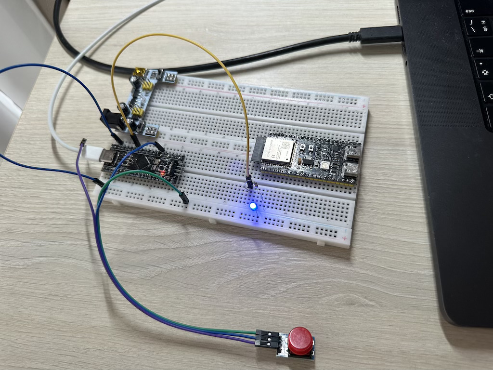

# Модуль 4.7. SWD debug

## Реалізація
- cвітлодіод загоряється і гасне через рівні проміжки часу (blink)
- rнопка довільно міняє період мигання
- реалізовано на STM32F411CEU6
- реалізовано за допомогою прямого доступу до реєстрів і без використання HAL для бізнес логіки (blink).

## Схема на макетній платі

[Video demo](video_demo.mp4)